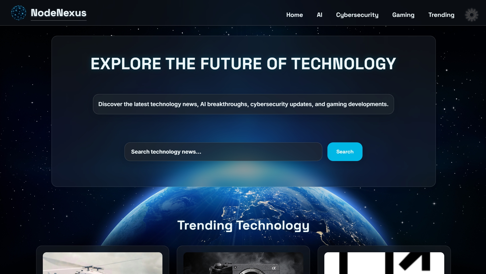
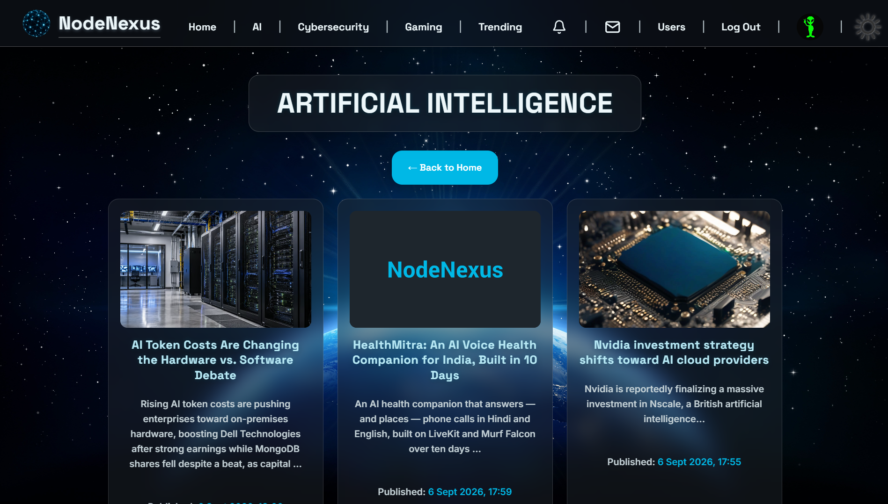
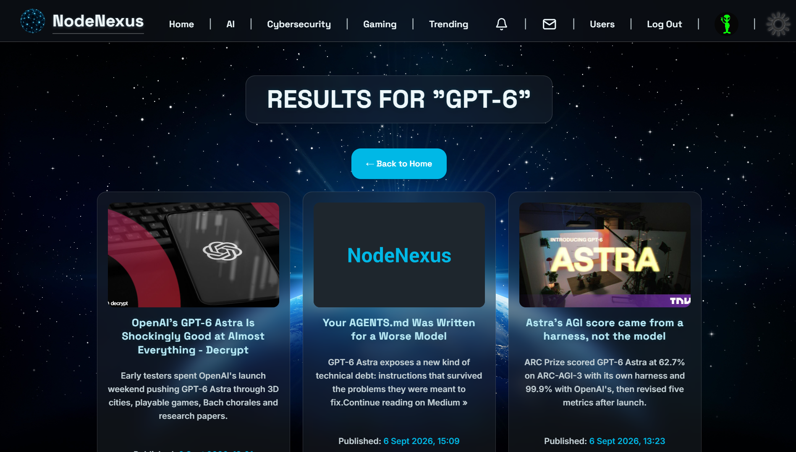

# NodeNexus - Explore The Future Of Technology

NodeNexus is a full-stack Django web application that aggregates technology news from external APIs, letting users discover the latest developments across AI, cybersecurity, gaming, and trending tech through a unified, searchable platform.

The application uses PostgreSQL for persistent storage and follows a structured Django project layout with separate `core` and `news` applications, keeping general site functionality distinct from news aggregation and API integration logic.

---

## Site Logo


---

## Application Link

### Live Site: [NodeNexus - Explore The Future Of Technology](https://nodenexus-htnu.onrender.com)

## Deployment

The application is deployed on Render using Gunicorn and PostgreSQL.

**Render Web Service configuration:**

- Build command: `pip install -r requirements.txt && python manage.py collectstatic --noinput`
- Start command: `cd backend && gunicorn config.wsgi:application`
- Environment variables set in the Render dashboard:
  - `SECRET_KEY`
  - `CURRENTS_API_KEY`
  - `DATABASE_URL` (provided automatically by the linked Render PostgreSQL instance)
  - `DEBUG`

**Database:**

A Render PostgreSQL instance is linked to the web service.

**Keeping the free web service warm:**

An external scheduled ping (cron-job.org) is used to periodically request the live site, reducing cold-start delays caused by Render's free tier spin-down behaviour.

---

## Technologies Used

- Python
- Django
- PostgreSQL
- Bootstrap
- HTML
- CSS
- JavaScript
- Currents API
- WhiteNoise
- Gunicorn

---

## Key Skills Demonstrated

- Django project structure using apps, views, templates, and services
- Separation of external API logic from Django views via a dedicated service layer
- REST API integration and response caching
- PostgreSQL relational database setup with Django
- Environment-based settings configuration for development and production
- Responsive frontend development combining Bootstrap and custom CSS
- Debugging real-world CSS stacking context and async race condition issues
- Production deployment and static file management using WhiteNoise and Render

---

## Features

### Technology News Aggregation

- Category pages for AI, Cybersecurity, Gaming, and Trending Technology
- Homepage featuring curated articles across all categories
- Content sourced live from the Currents API

---

### Article Search

- Global keyword search across articles
- Live search autocomplete with debounced requests
- Stale-response protection to prevent outdated results overwriting current ones

---

### Content Quality Filtering

- Duplicate articles removed based on source URL
- Known low-quality domains excluded from results
- Auto-generated vulnerability database listings filtered from cybersecurity results, while genuine journalism referencing a CVE is retained

---

### Pagination

- Previous/next page navigation across category and search results pages
- Page availability derived from the Currents API response rather than a fixed total
- Search queries preserved across paginated results

---

### Frontend

- Deep-space, cyan-accented glass UI design system
- Dark/light theme toggle with flash-of-unstyled-content prevention
- Responsive layout across desktop, tablet, and mobile
- Mobile bottom navigation with active page indication
- Off-canvas mobile menu
- Fallback placeholder image for missing or broken article images
- Site-wide loading overlay during navigation

---

## Architecture

The project follows a Django multi-app structure with a separated frontend/backend layout.

- `core` handles general site routing and category page views.
- `news` handles external API communication, caching, and search logic.
- A dedicated `services` layer within `news` separates Currents API integration from Django views.
- Reusable template components (navbar, footer, search bar, article cards, mobile navigation) reduce duplication across pages.

---

## Database

The application uses PostgreSQL, configured through Django's ORM and prepared for future expansion into user accounts, saved articles, comments, and direct messaging.

---

## Project Structure

```text
NodeNexus/
│
├── backend/
│   ├── config/
│   ├── core/
│   ├── news/
│   │   └── services/
│   ├── manage.py
│   └── requirements.txt
│
├── frontend/
│   └── src/
│       ├── components/
│       ├── pages/
│       └── static/
│           ├── css/
│           ├── images/
│           └── js/
│
├── docs/
│
├── Procfile
└── README.md
```

---

## Setup

1. Open a terminal in the `NodeNexus` folder.
2. Activate the virtual environment:
   - PowerShell: `.\.venv\Scripts\Activate.ps1`
   - Command Prompt: `.\.venv\Scripts\activate.bat`
3. Install dependencies:

```bash
pip install -r backend/requirements.txt
```

4. Set environment variables:
   - `SECRET_KEY`
   - `CURRENTS_API_KEY`
   - `DATABASE_URL`
   - `DEBUG`

---

## Run

Local development:

```bash
python backend/manage.py runserver
```

Gunicorn deployment:

```bash
cd backend && gunicorn config.wsgi:application
```

Collect static files for production:

```bash
python backend/manage.py collectstatic --noinput
```

---

## Routing Structure

- `backend/core/urls.py` → main pages (`/`, `/ai/`, `/cybersecurity/`, `/gaming/`, `/trending/`, `/search/`, `/auto-complete/`)

---

## Implemented Routes

| Route | Purpose |
|-------|---------|
| `/` | Homepage |
| `/ai/` | AI news category |
| `/cybersecurity/` | Cybersecurity news category |
| `/gaming/` | Gaming news category |
| `/trending/` | Trending technology category |
| `/search/` | Search results |
| `/auto-complete/` | Search autocomplete |

---

## Planned Features

- Article detail pages
- User accounts, authentication, and profiles
- Saved/bookmarked articles
- Comment system
- User-to-user direct messaging
- React frontend migration

---

## Documentation

- Documentation: [docs/NodeNexus-Documentation.md](docs/NodeNexus-Documentation.md)

---

## Screenshots

### Homepage



### Category Page



### Search Results

