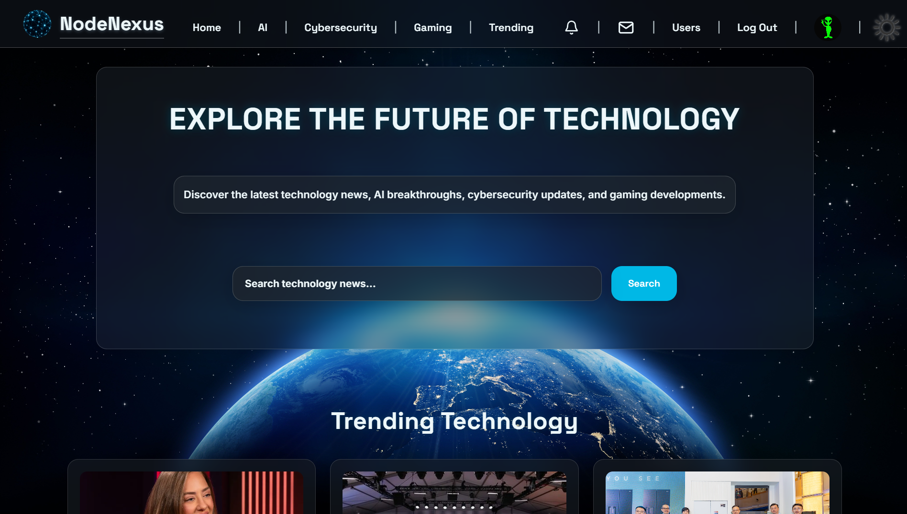
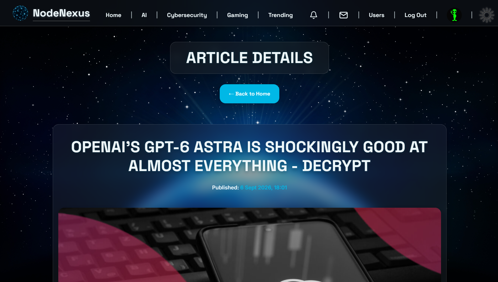
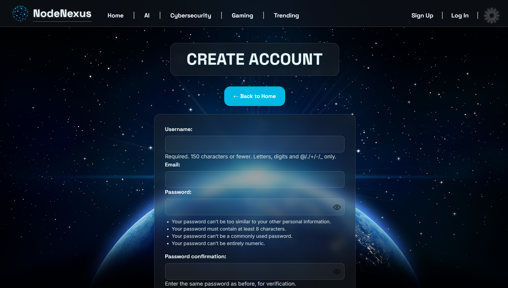
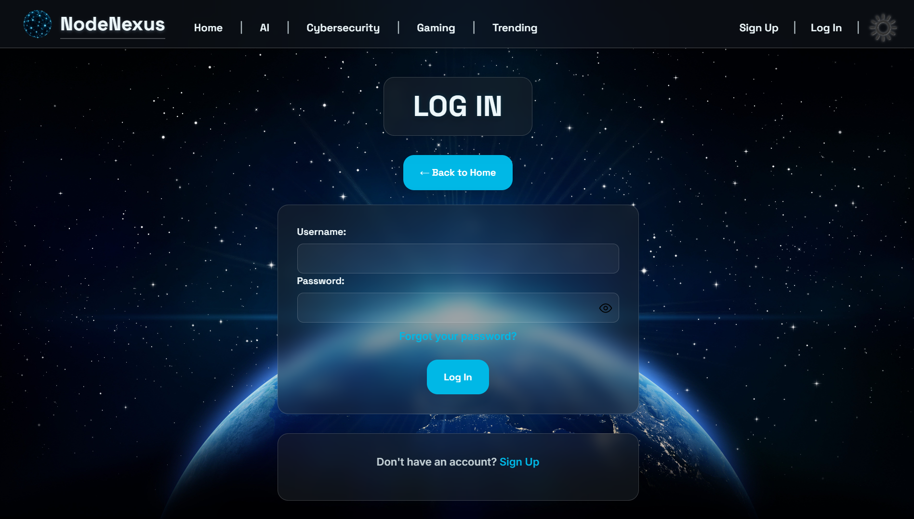
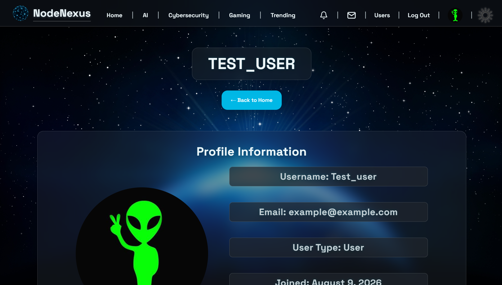
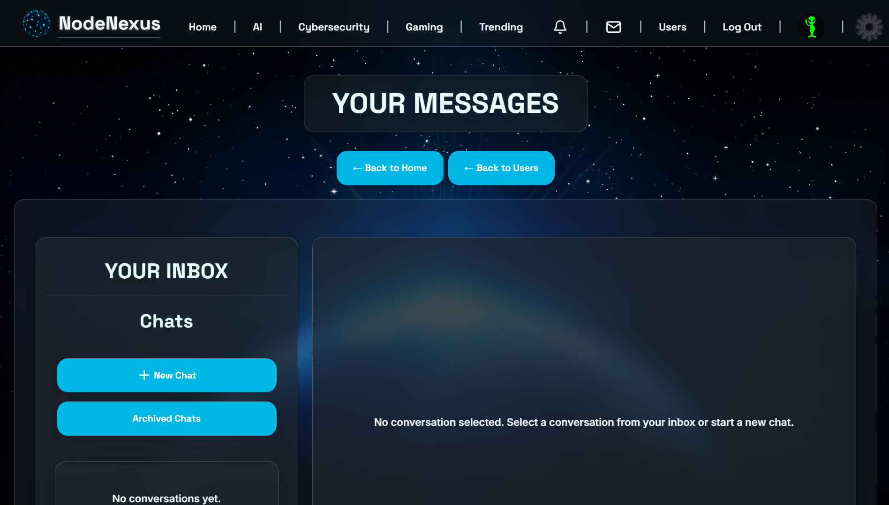

# NodeNexus - Explore The Future Of Technology

## Table of Contents

- [Overview](#Overview)
- [Site Logo](#site-logo)
- [Application Link](#application-link)
- [Deployment](#deployment)
- [Technologies Used](#technologies-used)
- [Key Skills Demonstrated](#key-skills-demonstrated)
- [Features](#features)
- [Architecture](#architecture)
- [Database](#database)
- [Project Structure](#project-structure)
- [Setup](#setup)
- [Run](#run)
- [Routing Structure](#routing-structure)
- [Implemented Routes](#implemented-routes)
- [Planned Features](#planned-features)
- [Documentation](#documentation)
- [Screenshots](#screenshots)

---

## Overview

NodeNexus is a full-stack Django web application that aggregates technology news from external APIs, letting users discover the latest developments across AI, cybersecurity, gaming, and trending tech through a unified, searchable platform.

The application also provides user authentication and account management, including profile editing, password management, profile picture selection and uploads, article bookmarking, comments, and nested replies. Authenticated users can also discover other users and communicate through a database-backed messaging system with conversations, message editing and deletion, conversation archiving, and persistent, real-time notifications delivered using Django Channels and WebSockets.

The application uses PostgreSQL for persistent storage and follows a structured Django project layout with separate `core`, `news`, `accounts`, and `messaging` applications, keeping general site functionality, news aggregation, account functionality, and messaging cleanly separated.

---

## Site Logo


---

## Application Link

### Live Site: [NodeNexus - Explore The Future Of Technology](https://nodenexus-htnu.onrender.com)

---

## Deployment

The application is deployed on Render using Daphne, PostgreSQL, and Cloudinary for user-uploaded profile images. Daphne is used as the ASGI server as NodeNexus uses Django Channels and WebSockets for real-time notifications.

**Render Web Service configuration:**

- Build command: `./build.sh`
- Start command: `cd backend && daphne -b 0.0.0.0 -p $PORT config.asgi:application`

The `build.sh` script installs the backend dependencies, runs database migrations, and collects static files before deployment.

- Environment variables set in the Render dashboard:
  - `SECRET_KEY`
  - `CURRENTS_API_KEY`
  - `DATABASE_URL` (provided automatically by the linked Render PostgreSQL instance)
  - `DEBUG`
  - `EMAIL_HOST`
  - `EMAIL_PORT`
  - `EMAIL_USE_TLS`
  - `EMAIL_HOST_USER`
  - `EMAIL_HOST_PASSWORD`
  - `CLOUDINARY_URL`

**Database:**

A Render PostgreSQL instance is linked to the web service.

**Media storage:**

Cloudinary is used to store custom user-uploaded profile images. Preset profile images are stored locally in the application's static files.

---

## Technologies Used

- Python
- Django
- Django Channels
- Daphne
- PostgreSQL
- Bootstrap
- HTML
- CSS
- JavaScript
- Currents API
- Cloudinary
- WhiteNoise

---

## Key Skills Demonstrated

- Django project structure using apps, views, forms, templates, and URL routing
- Django built-in authentication for user registration, login, and logout
- Custom Django forms for user registration and email validation
- Password validation using Django's built-in validators
- Django password reset and change password functionality
- SMTP email configuration using environment variables
- User profile editing and account management
- Custom profile picture uploads using Cloudinary
- Handling preset static images separately from user-uploaded media
- Using JavaScript to manage profile picture selection, previews, and modal behaviour
- Separation of external API logic from Django views via a dedicated service layer
- External API integration and response caching
- PostgreSQL database setup with Django's ORM
- Environment-based settings configuration for development and production
- Responsive frontend development combining Bootstrap and custom CSS
- Custom authentication and profile interface styling using HTML, CSS, and JavaScript
- Debugging real-world CSS layout, modal, stacking context, and responsive design issues
- Designing database-backed messaging with per-user conversation states
- Building persistent notifications with real-time delivery using Django Channels and WebSockets
- Production deployment and static/media file management using WhiteNoise, Cloudinary, and Render

---

## Features

### Technology News Aggregation

- Category pages for AI, Cybersecurity, Gaming, and Trending Technology
- Homepage featuring curated articles across all categories
- Content sourced live from the Currents API

---

### Article Search

- Global keyword search across articles
- Live search autocomplete with debounced requests
- Stale-response protection to prevent outdated results overwriting current ones

---

### Article Detail

- Dedicated article detail page for individual news stories
- Full article information presented separately from article cards
- Related articles matched by title keywords, displayed in a horizontal carousel on tablet and mobile
- Navigation from article cards to the corresponding article detail page

---

### Bookmarks

- Users can bookmark articles while viewing them
- Bookmarked articles are displayed on the user's profile
- Users can remove bookmarks from both the profile and article detail pages
- Articles are stored in the database when bookmarked or commented on
- An article remains stored while it has either bookmarks or comments
- An article is removed only when it has no remaining bookmarks or comments

---

### Comments and Replies

- Authenticated users can add comments to articles
- Users can reply to existing comments
- Replies can be nested within other replies
- Users can edit and delete their own comments
- Comments are displayed using a reusable template component
- Commenting on an unsaved article persists the article in the database
- Comments remain available when their author deletes their account
- Deleted users are displayed as "Deleted User" with a default profile image

---

### Messaging

- User discovery page for finding and starting conversations with other users
- Send and receive messages within a conversation
- Edit sent messages within a 15-minute window
- Delete messages, retained in the database and displayed as deleted rather than removed
- Archive conversations independently per user, without affecting the other participant's inbox
- Delete an entire conversation, removing it and its messages for both participants
- Responsive messaging layout across desktop and mobile

---

### Notifications

- Persistent, database-backed notifications created for new messages
- Real-time delivery using Django Channels and WebSockets
- Unread/read state with notification badges and dropdown
- Notifications link directly to the relevant conversation

---

### Content Quality Filtering

- Duplicate articles removed based on source URL
- Known low-quality domains excluded from results
- Auto-generated vulnerability database listings filtered from cybersecurity results, while genuine journalism referencing a CVE is retained

---

### Pagination

- Five-button numbered pagination with previous/next arrows across category and search results pages
- Page availability derived from the Currents API response rather than a fixed total
- Responsive layout: arrows beside the page buttons on desktop, arrows moved below the buttons on tablet and smaller
- Search queries preserved across paginated results

---

### Frontend

- Deep-space, cyan-accented glass UI design system
- Dark/light theme toggle with flash-of-unstyled-content prevention
- Responsive layout across desktop, tablet, and mobile
- Horizontal article carousel on tablet and mobile for both the homepage layout and related articles on the article detail page
- Mobile bottom navigation with active page indication
- Off-canvas mobile menu
- Fallback placeholder image for missing or broken article images
- Site-wide loading overlay during navigation

---

### User Authentication

- User registration using Django's built-in authentication system
- Username, email, password, and password confirmation fields
- Custom password validation
- Login and logout functionality
- Protected user profile page
- Profile editing and account information management
- Password reset by email using Django's built-in password reset system
- Change username and password for authenticated users
- Password visibility toggle using JavaScript
- Inline form validation and error messages provided by Django
- Authentication links integrated into the desktop and mobile navigation
- Profile picture selection through a custom modal
- Nine preset profile pictures matching the NodeNexus technology theme
- Custom profile picture uploads stored using Cloudinary
- JavaScript image preview for selected preset and uploaded profile pictures
- Profile picture displayed in the desktop navbar and mobile hamburger menu
- Permanent account deletion with password confirmation
- Deleted-user handling for persistent comments and replies

---

## Architecture

The project follows a Django multi-app structure with a separated frontend/backend layout.

- `core` handles general site routing and category page views.
- `news` handles external API communication, caching, search logic, articles, bookmarks, and comments.
- `accounts` handles user registration, login, logout, profile access, profile editing, profile pictures, password reset, and change password.
- `messaging` handles user discovery, conversations, messages, conversation archiving, and real-time notifications.
- The `Article`, `Bookmark`, and `Comment` models manage persistent articles, saved relationships, comments, and nested replies.
- The `Conversation`, `Message`, and `Notification` models manage messaging data and persistent, real-time notifications.
- A dedicated `services` layer within `news` separates Currents API integration from Django views.
- Reusable template components (navbar, footer, search bar, article cards, mobile navigation, messaging layout) reduce duplication across pages.
- Django's built-in authentication system handles user accounts and stores users in the PostgreSQL database.
- Django Channels and Daphne provide real-time WebSocket delivery for notifications.
- Cloudinary handles custom user-uploaded profile images, while preset profile images remain static assets.

---

## Database

The application uses PostgreSQL, configured through Django's ORM.

Django's built-in authentication tables are used for user accounts. The `Profile` model stores additional user profile information, including the selected preset profile image or custom Cloudinary image.

The `Article` model stores article data when users bookmark or comment on an article. The `Bookmark` model links saved articles to individual users. The `Comment` model links comments to users and articles and supports nested replies through a self-referencing parent relationship.

An article remains in the database while it has at least one bookmark or comment. When the final bookmark or comment is removed, the associated article record is deleted.

The `Conversation` and `Message` models store messaging data, including participants, timestamps, and per-user archive states. Deleting a conversation removes it and its associated messages for both participants. The `Notification` model stores persistent notifications linked to the recipient and the message that triggered them, including an unread state.

---

## Project Structure

```text
NodeNexus/
│
├── backend/
│   ├── accounts/
│   ├── config/
│   ├── core/
│   ├── messaging/
│   ├── news/
│   │   └── services/
│   ├── manage.py
│   └── requirements.txt
│
├── frontend/
│   └── src/
│       ├── components/
│       ├── pages/
│       └── static/
│           ├── css/
│           ├── images/
│           └── js/
│
├── docs/
│
├── build.sh
├── Procfile
└── README.md
```

---

## Setup

1. Open a terminal in the `NodeNexus` folder.

2. Activate the virtual environment:

   - PowerShell: `.\.venv\Scripts\Activate.ps1`
   - Command Prompt: `.\.venv\Scripts\activate.bat`
   - Bash / Git Bash: `source .venv/Scripts/activate`

3. Install dependencies:

```bash
pip install -r backend/requirements.txt
```

4. Set environment variables:
   - `SECRET_KEY`
   - `CURRENTS_API_KEY`
   - `DATABASE_URL`
   - `DEBUG`
   - `EMAIL_HOST`
   - `EMAIL_PORT`
   - `EMAIL_USE_TLS`
   - `EMAIL_HOST_USER`
   - `EMAIL_HOST_PASSWORD`
   - `CLOUDINARY_URL`

---

## Run

Local development:

```bash
python backend/manage.py runserver
```

Production build:

```bash
./build.sh
```

Production server:

```bash
cd backend && daphne -b 0.0.0.0 -p $PORT config.asgi:application
```

---

## Routing Structure

- `backend/config/urls.py` → includes the main application, news, and accounts routes
- `backend/core/urls.py` → main site pages (`/`, `/ai/`, `/cybersecurity/`, `/gaming/`, `/trending/`)
- `backend/news/urls.py` → article search, autocomplete, article detail, bookmarking, bookmark deletion, comments, comment editing, and comment deletion routes
- `backend/accounts/urls.py` → authentication routes for registration, login, logout, profile, delete account, profile editing, password reset, and change password
- `backend/messaging/urls.py` → user discovery, conversation creation, messaging, message editing/deletion, conversation archiving/deletion, and notification routes

---

## Implemented Routes

| Route                                                               | Purpose                         |
| ------------------------------------------------------------------- | ------------------------------- |
| `/`                                                                 | Homepage                        |
| `/ai/`                                                              | AI news category                |
| `/cybersecurity/`                                                   | Cybersecurity news category     |
| `/gaming/`                                                          | Gaming news category            |
| `/trending/`                                                        | Trending technology category    |
| `/search/`                                                          | Search results                  |
| `/auto-complete/`                                                   | Search autocomplete             |
| `/article/`                                                         | Individual article detail       |
| `/article/<int:article_id>/`                                        | Saved article detail page       |
| `/article/bookmark/`                                                | Bookmark an article             |
| `/article/<int:article_id>/delete/`                                 | Delete a bookmarked article     |
| `/article/comment/`                                                 | Add a comment                   |
| `/article/comment/<int:comment_id>/edit/`                           | Edit a comment                  |
| `/article/comment/<int:comment_id>/delete/`                         | Delete a comment                |
| `/signup/`                                                          | User registration               |
| `/login/`                                                           | User login                      |
| `/logout/`                                                          | User logout                     |
| `/profile/`                                                         | User profile                    |
| `/delete-account/`                                                  | Permanently delete user account |
| `/change_password/`                                                 | Change current password         |
| `/password_reset/`                                                  | Request password reset email    |
| `/password_reset_done/`                                             | Password reset email sent       |
| `/password_reset_confirm/`                                          | Set a new password              |
| `/password_reset_complete/`                                         | Password reset completed        |
| `/users/`                                                           | User discovery page             |
| `/users/<int:user_id>/`                                             | View another user's profile     |
| `/messages/`                                                        | Inbox / conversation list       |
| `/messages/new/`                                                    | Start a new conversation        |
| `/messages/<int:conversation_id>/`                                  | Conversation view               |
| `/messages/<int:conversation_id>/archive/`                          | Archive a conversation          |
| `/messages/archived/`                                               | View archived conversations     |
| `/messages/<int:conversation_id>/unarchive/`                        | Unarchive a conversation        |
| `/messages/<int:conversation_id>/delete/`                           | Delete a conversation           |
| `/messages/<int:conversation_id>/edit_message/<int:message_id>/`    | Edit a message                  |
| `/messages/<int:conversation_id>/delete_message/<int:message_id>/`  | Delete a message                |
| `/messages/notifications/`                                          | View notifications              |
| `/messages/notifications/<int:notification_id>/viewed/`             | Mark a notification as viewed   |

---

## Planned Features

- Admin functionality and role-based access control
- Django testing and project review

---

## Documentation

- Planning: [NodeNexus Planning Documentation](docs/planning.md)

- Documentation: [NodeNexus Project Documentation](docs/NodeNexus-Documentation.md)

---

## Screenshots

### Homepage



### Category Page


### Search Results


### Article Detail Page



### Sign Up 



### Log In



### Profile



### Inbox

