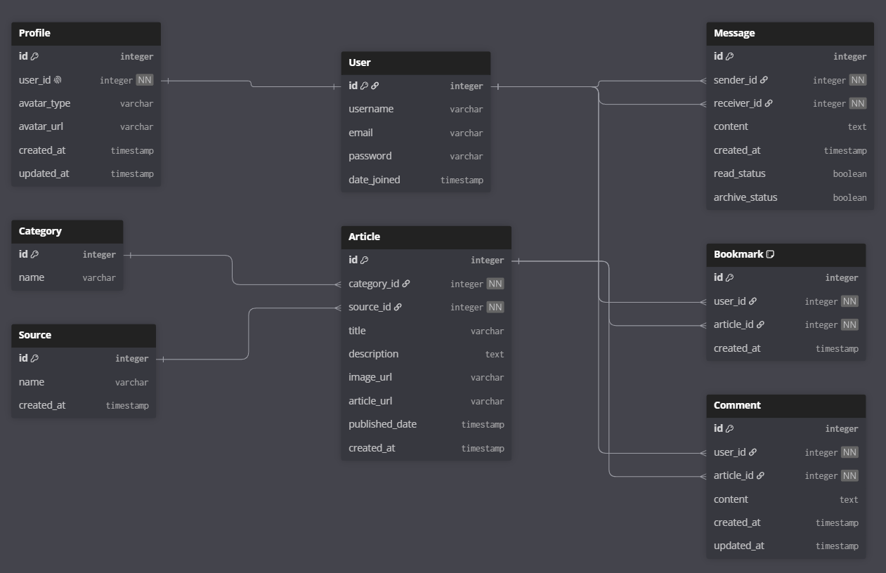

# NodeNexus — Project Planning

# Table of Contents

1. [Project Overview](#1-project-overview)
2. [Project Goals](#2-project-goals)
3. [Technology Stack](#3-technology-stack)
4. [Core Features](#4-core-features)
5. [User Profiles](#5-user-profiles)
6. [News Aggregation System](#6-news-aggregation-system)
7. [Search System](#7-search-system)
8. [Caching System](#8-caching-system)
9. [Application Pages](#9-application-pages)
10. [User Features](#10-user-features)
11. [Database Design Overview](#11-database-design-overview)
12. [Backend Architecture](#12-backend-architecture)
13. [Frontend Design](#13-frontend-design)
14. [Security Features](#14-security-features)
15. [Future Enhancements](#15-future-enhancements)
16. [Development Approach](#16-development-approach)
17. [Database Entity Relationship Diagram](#17-database-entity-relationship-diagram)

---

## 1. Project Overview

NodeNexus is a full-stack technology news hub built using Django and PostgreSQL, with HTML, Bootstrap, and vanilla JavaScript used for the frontend. The application will be deployed using Render.

The purpose of NodeNexus is to provide users with a central platform for discovering technology news across multiple areas, including artificial intelligence, cybersecurity, gaming, and general technology trends.

The platform will aggregate real-world news content from external APIs, process the data, and present it through a responsive and modern interface. Users will be able to create accounts, manage profiles, and save articles for later viewing.

---

# 2. Project Goals

The main goals of NodeNexus are:

- Build a modern technology news aggregation platform.
- Integrate multiple external APIs into one unified application.
- Provide users with personalised account features.
- Demonstrate Django, PostgreSQL, API integration, authentication, and deployment skills.
- Create a modular and maintainable application structure.

---

# 3. Technology Stack

## Backend

- Django
- PostgreSQL
- Django ORM
- Django Authentication System

## Frontend

- HTML
- CSS
- Bootstrap
- Vanilla JavaScript

## External Services

- Currents API
- APITube API
- Cloudinary for profile image storage

## Hosting

- Render

---

# 4. Core Features

## User Authentication

NodeNexus will use Django's built-in authentication system.

Users will be able to:

- Register an account.
- Login and logout.
- Recover forgotten passwords through email.
- Manage their profile information.
- Delete their account.

Django will handle:

- Password hashing.
- User sessions.
- Authentication security.

---

# 5. User Profiles

Each user will have a connected profile model extending Django's built-in User model.

The Profile model will store additional user information.

Profile features:

- Custom profile picture upload through Cloudinary.
- Preselected avatar options.
- Account creation date.

Profile actions:

- View profile.
- Edit profile details.
- Change profile picture.
- View saved articles.
- Access messages.
- Logout.
- Delete account.
- Password recovery.

---

# 6. News Aggregation System

NodeNexus will collect technology news from two external APIs.

## Currents API

Used for:

- General technology news.
- Artificial intelligence news.
- Gaming news.
- Trending technology content.

## APITube API

Used specifically for:

- Cybersecurity news.
- Security-related searches.
- Technical security content.

Both APIs will be converted into a consistent internal article format before being displayed to users.

---

# 7. Search System

The homepage will contain the global search bar.

When a user performs a search:

1. The search query is converted to lowercase.
2. The system checks the query against a predefined cybersecurity keyword list.
3. If a cybersecurity keyword is detected:
   - The request is routed through the APITube pipeline.
4. If no cybersecurity keywords are detected:
   - The request is routed through the Currents API pipeline.
5. Results are processed through the caching system.
6. API responses are normalised into a consistent article format.
7. Results are displayed on a unified search results page.

Example cybersecurity keywords:

- ransomware
- malware
- breach
- vulnerability
- exploit

---

# 8. Caching System

A caching layer will be implemented to reduce unnecessary API requests.

The caching system will:

- Protect API usage limits.
- Improve response times.
- Reduce repeated external requests.
- Provide fallback data where possible.

Cached API responses will expire after a set period before fresh data is requested.

---

# 9. Application Pages

## Homepage

The homepage will include:

- Global search bar.
- Curated technology content.
- Trending technology content.
- Navigation to different categories.

## News Categories

Dedicated pages:

- AI
- Cybersecurity
- Gaming
- Trending

## Account Pages

Authentication and user management pages:

- Register.
- Login.
- Profile.
- Edit profile.
- Password reset.
- Account deletion.

## Messages

A dedicated messaging page will allow users to:

- Send messages.
- Receive messages.
- View inbox.
- Archive messages.

---

# 10. User Features

## Saved Articles

Users can bookmark articles to revisit later.

Users will be able to:

- Save articles.
- Remove saved articles.
- View saved articles from their profile.

---

# 11. Database Design Overview

The application will use PostgreSQL for data storage.

## User

Django built-in authentication model.

Stores:

- Username.
- Email.
- Password.
- Authentication information.
- Date joined.

Relationships:

- One User has one Profile.
- One User can create many Bookmarks.
- One User can create many Comments.
- One User can send and receive many Messages.

---

## Profile

Extends Django's built-in User model through a one-to-one relationship.

Stores:

- Avatar information.
- Profile details.
- Account creation date.
- Last profile update date.

Relationship:

- One Profile belongs to one User.

---

## Article

Central content table storing aggregated news content.

Stores:

- Title.
- Description.
- Image URL.
- External article URL.
- Published date.
- Date added to NodeNexus.
- Category relationship.
- Source relationship.

Relationships:

- One Article belongs to one Category.
- One Article belongs to one Source.
- One Article can have many Bookmarks.
- One Article can have many Comments.

---

## Category

Stores article categories.

Stores:

- Category name.

Examples:

- AI.
- Cybersecurity.
- Gaming.
- Trending.

---

## Source

Stores external API sources.

Stores:

- Source name.
- API source information.

Examples:

- Currents.
- APITube.

---

## Bookmark

Join table connecting Users and Articles.

Allows users to save articles for later.

Stores:

- User relationship.
- Article relationship.
- Saved timestamp.

Relationships:

- One User can save many Articles.
- One Article can be saved by many Users.

---

## Comment

Stores user comments on articles.

Stores:

- User relationship.
- Article relationship.
- Comment text.
- Created timestamp.
- Updated timestamp.

Relationships:

- One User can create many Comments.
- One Article can have many Comments.

---

## Message

Stores user-to-user inbox messages.

Stores:

- Sender relationship.
- Receiver relationship.
- Message content.
- Created timestamp.
- Read status.
- Archive status.

Relationships:

- One User can send many Messages.
- One User can receive many Messages.

---

# 12. Backend Architecture

NodeNexus will use a modular Django structure.

External API logic, caching, and search routing will be separated into service modules.

Example:

```
services/

currents.py
apitube.py
cache.py
search_router.py
```

Responsibilities:

- `currents.py` handles Currents API communication.
- `apitube.py` handles APITube API communication.
- `cache.py` manages API caching.
- `search_router.py` decides which API pipeline is used.

---

# 13. Frontend Design

NodeNexus will use a technology-focused design.

## Theme

Colour palette:

- Cyan accent colour.
- Light grey light mode.
- Dark grey dark mode.
- Black text in light mode.
- White text in dark mode.

## Visual Identity

The design will use:

- Earth and space imagery.
- Glass-style UI sections.
- Responsive layouts.
- Mobile bottom navigation.
- Desktop navigation menus.

---

# 14. Security Features

NodeNexus will use Django's built-in security features.

Security measures:

- Secure password hashing.
- Authentication permissions.
- User-based access control.
- Protected account actions.

---

# 15. Future Enhancements

Possible future addition:

- Article comments.

These features are not part of the initial build.

---

# 16. Development Approach

Development will follow an incremental approach.

## Phase 1

- Create Django project.
- Connect PostgreSQL database.
- Establish application structure.
- Create base templates.

## Phase 2

- Build authentication system.
- Create user profiles.
- Create database models.

## Phase 3

- Integrate external APIs.
- Implement search routing.
- Add caching system.

## Phase 4

- Build frontend pages.
- Implement responsive design.
- Add user features.

## Phase 5

- Testing.
- Security checks.
- Deployment on Render.

---

---

# 17. Database Entity Relationship Diagram

The following ERD represents the planned PostgreSQL database structure for NodeNexus, including table relationships between users, profiles, articles, categories, sources, bookmarks, comments, and messages.



---